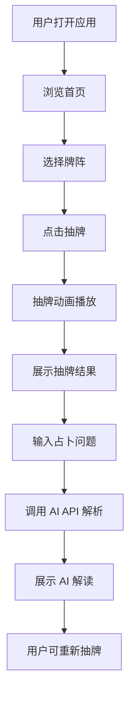

## 1. 产品概述

一款融合神秘学与 AI 技术的塔罗牌占卜 Web 应用，用户可在线抽牌并获得 AI 智能解析。支持自定义 API 接入，为用户提供个性化、沉浸式的塔罗体验。

- 核心价值：将传统塔罗占卜与现代 AI 技术结合，为用户提供随时随地的塔罗解读服务
- 目标用户：对塔罗牌、神秘学感兴趣的年轻人，以及希望通过 AI 获得心理洞察的普通用户

## 2. 核心功能

### 2.1 用户角色
| 角色 | 注册方式 | 核心权限 |
|------|---------|---------|
| 访客 | 无需注册 | 浏览塔罗牌库、抽牌、AI 解析 |

### 2.2 功能模块
1. **首页**：沉浸式品牌展示、快速抽牌入口
2. **牌库浏览**：78 张塔罗牌的完整展示与详情
3. **抽牌占卜**：支持多种牌阵（单张、三张、十字阵），随机抽牌
4. **AI 解析**：调用自定义 AI API 对牌面进行智能解读
5. **设置**：自定义 API 配置（Endpoint、Key、Model）

### 2.3 页面详情
| 页面名称 | 模块名称 | 功能描述 |
|---------|---------|---------|
| 首页 | Hero 区 | 动态星空背景、品牌标语、快速抽牌按钮 |
| 首页 | 牌阵选择 | 三种牌阵卡片展示与选择 |
| 牌库 | 全部牌展示 | 大阿卡纳/小阿卡纳分类展示，每张牌可点击查看详情 |
| 牌库 | 牌详情 | 展示牌名、序号、正逆位、寓意、符号解析 |
| 抽牌 | 抽牌动画 | 牌面翻转动画，灯光、粒子特效 |
| 抽牌 | 解析结果 | AI 生成的牌面解读，含正位/逆位含义、建议 |
| 设置 | API 配置 | 输入 API Endpoint、API Key、模型名称 |

## 3. 核心流程

用户打开应用 → 浏览首页 → 选择牌阵类型 → 点击抽牌 → 观看抽牌动画 → 查看抽牌结果 → 点击 AI 解析 → 输入占卜问题 → AI 生成解读 → 查看完整解析

## 4. 用户界面设计

### 4.1 设计风格
- **设计主题**：神秘学暗黑风，深邃星空氛围
- **主色调**：深蓝黑 `#0a0e1a`、暗紫 `#1a1040`
- **辅色调**：金色 `#d4a853`、月光白 `#e8e0f0`
- **强调色**：星芒蓝 `#4a7cff`、神秘紫 `#8b5cf6`
- **字体**：标题用 "Cinzel" 古典衬线体，正文用 "Cormorant Garamond" 优雅衬线体
- **按钮风格**：带有金色边框的深色按钮，hover 时发光效果
- **布局风格**：对称居中布局，卡片式展示，大量留白与负空间
- **动画风格**：卡片翻转、渐变淡入、粒子飘散、星空闪烁

### 4.2 页面设计概览
| 页面名称 | 模块名称 | UI 元素 |
|---------|---------|---------|
| 首页 | Hero 区 | 全屏星空背景、大标题 "命运之轮"、副标题、CTA 按钮 |
| 首页 | 牌阵选择 | 三张风格化卡片（单张/三张/十字阵），悬停发光 |
| 牌库 | 牌网格 | 78 张牌以网格排列，每张为卡片样式，分类标签切换 |
| 牌库 | 牌详情 | 弹窗/独立页展示牌面大图、正逆位、详细寓意 |
| 抽牌 | 抽牌过程 | 牌背面朝上排开，点击后翻转动画，粒子爆发效果 |
| 抽牌 | 解析结果 | 牌面展示 + 占卜问题 + AI 生成的长文解读，打字机效果输出 |
| 设置 | API 配置 | 三个输入框（Endpoint/Key/Model）+ 测试连接按钮 |

### 4.3 响应式
- 桌面端优先设计，完美适配 1440px+ 屏幕
- 平板端适配 768px-1024px，牌网格改为 3 列
- 移动端 375px-768px，牌网格 2 列，简化动画

## 5. 塔罗牌数据

### 5.1 大阿卡纳（22 张）
愚者、魔术师、女祭司、皇后、皇帝、教皇、恋人、战车、力量、隐士、命运之轮、正义、倒吊人、死神、节制、恶魔、高塔、星星、月亮、太阳、审判、世界

### 5.2 小阿卡纳（56 张）
分为四组：权杖（Wands）、圣杯（Cups）、宝剑（Swords）、星币（Pentacles）
每组 14 张：Ace 到 10 + 侍从、骑士、皇后、国王