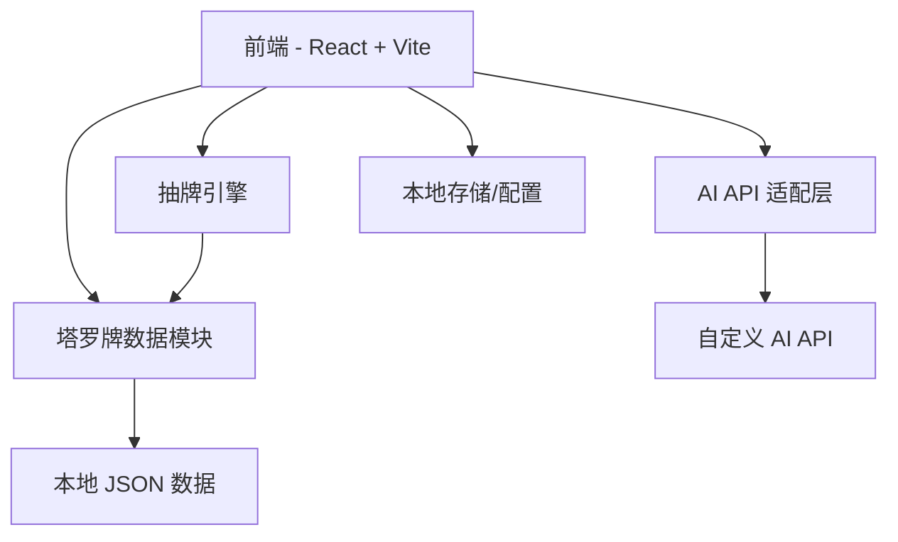
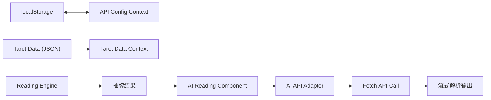

## 1. 架构设计



## 2. 技术说明

- **前端框架**：React 18 + TypeScript + Vite
- **样式方案**：Tailwind CSS 3 + 自定义 CSS 变量
- **动画库**：Framer Motion（牌面翻转、页面过渡、粒子效果）
- **状态管理**：React Context / useReducer
- **数据存储**：本地 JSON 文件（塔罗牌数据）、localStorage（API 配置持久化）
- **初始化工具**：vite (create-vite)
- **包管理器**：npm

## 3. 路由定义

| 路由 | 用途 |
|------|------|
| / | 首页：品牌展示 + 快速抽牌入口 |
| /cards | 牌库：浏览全部 78 张塔罗牌 |
| /cards/:id | 牌详情：查看单张牌详细信息 |
| /reading | 抽牌：选择牌阵 → 抽牌 → 展示结果 |
| /settings | 设置：配置 AI API 参数 |

## 4. 核心数据模型

### 4.1 塔罗牌数据 (TarotCard)

```typescript
interface TarotCard {
  id: number
  name: string          // 牌名（中文）
  nameEn: string        // 牌名（英文）
  arcana: 'major' | 'minor'  // 大阿卡纳 / 小阿卡纳
  suit?: 'wands' | 'cups' | 'swords' | 'pentacles'  // 小阿卡纳的花色
  number: number        // 序号
  keywords: string[]    // 关键词
  meaningUpright: string  // 正位含义
  meaningReversed: string // 逆位含义
  description: string   // 牌面描述
  symbolAnalysis: string // 符号解析
  imagePrompt: string   // 牌面生成提示词
}
```

### 4.2 牌阵定义 (Spread)

```typescript
interface Spread {
  id: string
  name: string           // 牌阵名称
  positions: SpreadPosition[]
}

interface SpreadPosition {
  name: string           // 位置名称（如"过去"、"现在"、"未来"）
  description: string    // 位置含义
}
```

### 4.3 AI API 配置

```typescript
interface ApiConfig {
  endpoint: string       // API 地址
  apiKey: string         // API Key
  model: string          // 模型名称
}
```

## 5. AI API 适配层设计

支持兼容 OpenAI API 格式的自定义接口。用户可在设置页面填入：
- API Endpoint（如 `https://api.openai.com/v1/chat/completions`）
- API Key
- Model（如 `gpt-4o`、`deepseek-chat` 等）

API 调用将使用 fetch 直接请求，支持流式输出（SSE）以实现打字机效果。

### API 请求格式

```typescript
interface AIRequest {
  model: string
  messages: Array<{
    role: 'system' | 'user'
    content: string
  }>
  stream: boolean
  temperature: number
}

interface AIResponse {
  choices: Array<{
    delta?: { content: string }
    message?: { content: string }
  }>
}
```

## 6. 组件树设计

```
App
├── Layout
│   ├── Header (导航：首页、牌库、抽牌、设置)
│   └── Footer
├── Pages
│   ├── HomePage
│   │   ├── HeroSection (星空背景 + 标语)
│   │   └── SpreadSelector (牌阵选择)
│   ├── CardLibraryPage
│   │   ├── ArcanaFilter (大/小分类切换)
│   │   └── CardGrid (牌网格)
│   │       └── CardItem (单张牌)
│   ├── CardDetailPage
│   │   └── CardDetail (牌详情)
│   ├── ReadingPage
│   │   ├── SpreadDisplay (牌阵布局)
│   │   ├── CardFlip (抽牌动画)
│   │   └── AIReading (AI 解析结果)
│   └── SettingsPage
│       └── ApiConfigForm (API 配置表单)
└── Components
    ├── StarField (星空粒子背景)
    ├── ParticleEffect (粒子特效)
    ├── LoadingSpinner (加载动画)
    └── Toast (提示消息)
```

## 7. 数据流



## 8. 本地开发与构建

- **开发命令**：`npm run dev` → 启动本地开发服务器
- **构建命令**：`npm run build` → 产出 dist 目录
- **预览命令**：`npm run preview`